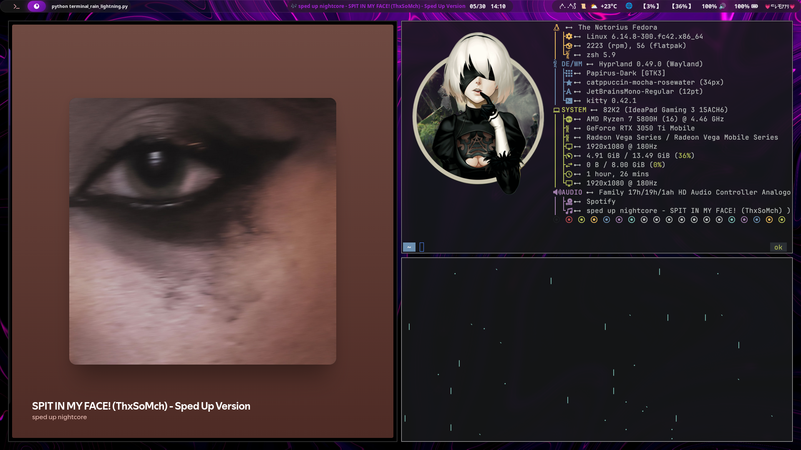

# hyprland-dotfiles-cleppy

This repository contains my customized configuration files and assets for **Hyprland**, **Hyprlock**, **Waybar**, and related tools, designed to provide a polished and cohesive Linux desktop experience.

## What is Included?

- **Hyprland**: Custom configuration for the Hyprland compositor, including window management and wallpaper settings.
- **Hyprlock**: Customized lock screen setup with assets and configuration.
- **Wallust**: A set of theming templates and configurations for consistent color schemes across various applications like Kitty terminal, Rofi, Waybar, and swaync.
- **Waybar**: Status bar configuration and styles designed for Hyprland.

---

## Preview



---

## Usage

1. Clone this repository to your local machine:

   ```bash
   git clone https://github.com/cleppy/hyprland-dotfiles-cleppy.git
   cd hyprland-dotfiles-cleppy

    Copy or symlink configuration files to your Hyprland config directory (~/.config/hypr/), Waybar, Hyprlock, etc., depending on your setup:

    ln -s /path/to/hyprland-dotfiles/hypr/hyprland.conf ~/.config/hypr/hyprland.conf
    ln -s /path/to/hyprland-dotfiles/hypr/hyprpaper.conf ~/.config/hypr/hyprpaper.conf
    ln -s /path/to/hyprland-dotfiles/hyprlock/hyprlock.conf ~/.config/hyprlock/hyprlock.conf
    ln -s /path/to/hyprland-dotfiles/waybar/config ~/.config/waybar/config
    ln -s /path/to/hyprland-dotfiles/waybar/style.css ~/.config/waybar/style.css

    Adjust paths if necessary and restart Hyprland or related services to see changes.

Customization
    
    You can edit the configuration files under wallust/templates/ to modify color schemes.

    Wallust is used for managing consistent theming — make sure it is installed and properly configured with wallust.toml.

    Specify wallpaper path in hyprpaper.conf

    Feel free to adapt the config files to your personal preferences.

Requirements

    Highly recommended to use "https://github.com/rmaake1/terminal-rain-lightning" this repo with scripts.
    
    Hyprland compositor

    Hyprlock for locking screen

    Waybar status bar

    Wallust for theming (optional but recommended)

